# 程序集引用图

> 双端（Unity 客户端 + dotnet 服务端）**全量程序集引用关系**，含测试与编辑器档位。
> 口径时点：2026-10-03 实测——`Tests.slnx` 16 工程 + `Assets/` 54 个 asmdef + 各双轨 csproj 的 `references` / `ProjectReference`；双轨程序集（asmdef ⇄ csproj 共编同一份源码）合并为单节点，两侧引用已核对一致。
> 本图只回答"谁引谁"；"是什么/去哪改"归[代码地图](代码地图.md)，设计动机归 `Docs/design/`。

## 图

```mermaid
flowchart LR
  %% ============ ① 双轨程序集（双端同源） ============
  subgraph S1["① 双轨程序集 — Unity asmdef ⇄ dotnet csproj 共编同一份源码"]
    LFCore["LiteFramework.Core"]
    LFAsync["LiteFramework.Async ⊕UniTask"]
    SimCore["LiteSim.Core"]
    LiteNet["LiteNet ⊕Google.Protobuf·kcp2k"]
    RSRT["RoomServer.Runtime 房间内核"]
    RSAPP["RoomServer.Application.Runtime ⊕Google.Protobuf"]
    LTC["LiteTesting.Core (netstandard2.1)"]
    DS["DisciplineScanner"]
  end

  %% ============ ② 客户端运行时（Unity） ============
  subgraph S2["② 客户端运行时（Unity asmdef，含引擎引用）"]
    LFUnity["LiteFramework.Unity ⊕UniTask"]
    SimView["LiteSim.View ⊕UniTask"]
    LCAbs["LiteClient.Abstractions"]
    LCRun["LiteClient.Runtime"]
    LCKcp["LiteClient.Network.Kcp"]
    LCPlat["LiteClient.Platform.Unity ⊕Cinemachine⊕InputSystem"]
    LCLuban["LiteClient.Serialization.Luban ⊕Luban.Runtime"]
    LCYoo["LiteClient.Content.YooAsset ⊕YooAsset"]
    LCXlua["LiteClient.Scripting.XLua ⊕xLuaMain"]
    LubanT["Luban.Tables ⊕Luban.Runtime"]
    LCGenR["LiteCodeGen.Runtime"]
    GameUI["LiteGame.UI ⊕DOTween⊕TMP"]
    LuaBridge["LiteGame.LuaBridge"]
    DevLocal["LiteGame.DevLocalServer"]
    App["LiteGame.App（入口组装）"]
    DevHUD["LiteGame.DevHUD"]
  end

  %% ============ ③ 服务端宿主（dotnet） ============
  subgraph S3["③ 服务端宿主（.NET 8）"]
    RSExe["Server/RoomServer Exe<br/>⊕Luban源链接"]
    MetaExe["Server/MetaServer Exe<br/>⊕AspNetCore.App⊕MongoDB.Driver"]
  end

  %% ============ ④ 编辑器/工具 ============
  subgraph S4["④ 编辑器/工具（Editor-only）"]
    SimCoreEd["LiteSim.Core.Editor"]
    LCGenE["LiteCodeGen.Editor"]
    GameEditor["LiteGame.Editor ⊕YooAsset.Editor"]
    DSEd["DisciplineScanner.Editor"]
    LTUEd["LiteTesting.Unity.Editor"]
  end

  %% ============ ⑤ Unity 内测试（L2） ============
  subgraph S5["⑤ Unity 测试（L2 · UNITY_INCLUDE_TESTS）"]
    LTRun["LiteTesting.Runtime ⊕TestRunner"]
    EdmTests["LiteGame.EditModeTests ⊕nunit⊕DOTween"]
    PmTests["LiteGame.UI.PlayModeTests ⊕nunit"]
  end

  %% ============ ⑥ dotnet 测试（L1/L3） ============
  subgraph S6["⑥ dotnet 测试（L1/L3 · xunit）"]
    LFT["LiteFramework.Core.Tests"]
    LNT["LiteNet.Tests"]
    SimT["LiteSim.Core.Tests"]
    LTCT["LiteTesting.Core.Tests"]
    MetaT["MetaServer.Tests"]
    MetaIT["MetaServer.Integration.Tests ⊕MongoDB.Driver(L3)"]
  end

  %% --- ①内部 ---
  LFAsync --> LFCore
  LiteNet --> SimCore
  RSRT --> SimCore
  RSAPP --> RSRT
  RSAPP --> LiteNet
  RSAPP --> SimCore

  %% --- ②客户端运行时 ---
  LFUnity --> LFCore
  LFUnity --> LFAsync
  SimView --> LFUnity
  SimView --> LFAsync
  SimView --> LFCore
  SimView --> SimCore
  LCAbs --> LFAsync
  LCAbs --> LFCore
  LCRun --> LCAbs
  LCRun --> LFUnity
  LCRun --> LFAsync
  LCRun --> LFCore
  LCRun --> LiteNet
  LCRun --> SimCore
  LCRun --> SimView
  LCKcp --> LFUnity
  LCKcp --> LFAsync
  LCKcp --> LFCore
  LCKcp --> LiteNet
  LCPlat --> LCRun
  LCPlat --> LCAbs
  LCPlat --> LFCore
  LCPlat --> LFAsync
  LCPlat --> SimCore
  LCPlat --> SimView
  LCLuban --> LCAbs
  LCLuban --> LFCore
  LCLuban --> LFAsync
  LCLuban --> SimCore
  LCLuban --> LubanT
  LCYoo --> LCAbs
  LCYoo --> LCRun
  LCYoo --> LFUnity
  LCYoo --> LFCore
  LCYoo --> LFAsync
  LCXlua --> LCAbs
  LCXlua --> LCRun
  LCXlua --> LFUnity
  LCXlua --> LFCore
  LCXlua --> LFAsync
  GameUI --> LCGenR
  GameUI --> LFAsync
  GameUI --> LFCore
  LuaBridge --> GameUI
  LuaBridge --> LCXlua
  LuaBridge --> LCLuban
  LuaBridge --> LCAbs
  LuaBridge --> LFCore
  LuaBridge --> LFAsync
  LuaBridge --> LubanT
  DevLocal --> LCRun
  DevLocal --> LiteNet
  DevLocal --> SimCore
  DevLocal --> RSAPP
  DevLocal --> RSRT
  App --> LCAbs
  App --> LCYoo
  App --> LCKcp
  App --> LCPlat
  App --> LCRun
  App --> LCXlua
  App --> LCLuban
  App --> LFAsync
  App --> LFCore
  App --> LFUnity
  App --> DevLocal
  App --> LuaBridge
  App --> GameUI
  App --> LiteNet
  App --> SimCore
  App --> SimView
  App --> LubanT
  DevHUD --> App
  DevHUD --> GameUI
  DevHUD --> LCAbs
  DevHUD --> LCYoo
  DevHUD --> LCKcp
  DevHUD --> LCRun
  DevHUD --> LCXlua
  DevHUD --> LCLuban
  DevHUD --> LFAsync
  DevHUD --> LFCore
  DevHUD --> LFUnity
  DevHUD --> SimCore

  %% --- ③服务端宿主 ---
  RSExe --> LiteNet
  RSExe --> SimCore
  RSExe --> RSRT
  RSExe --> RSAPP

  %% --- ④编辑器/工具 ---
  SimCoreEd --> SimCore
  LCGenE --> LCGenR
  GameEditor --> LCAbs
  GameEditor --> LCYoo
  GameEditor --> LCKcp
  GameEditor --> LCRun
  GameEditor --> LCXlua
  GameEditor --> LCLuban
  GameEditor --> LCGenE
  GameEditor --> LCGenR
  GameEditor --> LFAsync
  GameEditor --> LFCore
  GameEditor --> LFUnity
  GameEditor --> App
  GameEditor --> LuaBridge
  GameEditor --> GameUI
  GameEditor --> SimCore
  GameEditor --> LubanT
  DSEd --> DS
  LTUEd --> LTC

  %% --- ⑤Unity 测试 ---
  LTRun --> LTC
  EdmTests --> LCAbs
  EdmTests --> LCYoo
  EdmTests --> LCKcp
  EdmTests --> LCRun
  EdmTests --> LCXlua
  EdmTests --> LCLuban
  EdmTests --> LFAsync
  EdmTests --> LFCore
  EdmTests --> LFUnity
  EdmTests --> App
  EdmTests --> GameEditor
  EdmTests --> LuaBridge
  EdmTests --> GameUI
  EdmTests --> LiteNet
  EdmTests --> SimCore
  EdmTests --> SimCoreEd
  EdmTests --> SimView
  EdmTests --> LTC
  EdmTests --> LTUEd
  EdmTests --> LubanT
  PmTests --> LCAbs
  PmTests --> LCYoo
  PmTests --> LCKcp
  PmTests --> LCRun
  PmTests --> LCXlua
  PmTests --> LCLuban
  PmTests --> LFAsync
  PmTests --> LFCore
  PmTests --> LFUnity
  PmTests --> App
  PmTests --> LuaBridge
  PmTests --> GameUI
  PmTests --> SimCore
  PmTests --> SimView
  PmTests --> LTC
  PmTests --> LTRun

  %% --- ⑥dotnet 测试 ---
  LFT --> LFCore
  LFT --> LFAsync
  LFT --> DS
  LFT --> LTC
  LNT --> LiteNet
  LNT --> SimCore
  LNT --> RSExe
  LNT --> LTC
  LNT --> LFCore
  SimT --> SimCore
  SimT --> LTC
  SimT -. "源链接" .-> SimView
  SimT -. "源链接" .-> LCRun
  LTCT --> LTC
  MetaT --> MetaExe
  MetaT --> LTC
  MetaIT --> MetaExe
  MetaIT --> LTC

  classDef shared fill:#e8f5e9,stroke:#2e7d32
  classDef client fill:#e3f2fd,stroke:#1565c0
  classDef server fill:#fff3e0,stroke:#ef6c00
  classDef editor fill:#f5f5f5,stroke:#757575
  classDef utest fill:#f3e5f5,stroke:#7b1fa2
  classDef dtest fill:#ede7f6,stroke:#5e35b1
  class LFCore,LFAsync,SimCore,LiteNet,RSRT,RSAPP,LTC,DS shared
  class LFUnity,SimView,LCAbs,LCRun,LCKcp,LCPlat,LCLuban,LCYoo,LCXlua,LubanT,LCGenR,GameUI,LuaBridge,DevLocal,App,DevHUD client
  class RSExe,MetaExe server
  class SimCoreEd,LCGenE,GameEditor,DSEd,LTUEd editor
  class LTRun,EdmTests,PmTests utest
  class LFT,LNT,SimT,LTCT,MetaT,MetaIT dtest
```

## 图例

RoomServer 源链接 `Assets/LiteClient/Adapters/Serialization.Luban/SimConfigMapper.cs`，只共编无 Unity/UniTask 依赖的数值映射文件，不引用 `LiteClient.Serialization.Luban` 程序集。该映射把战斗/移动/实体三表组合为 `CombatValues`；程序集连线保持原样。

- `A --> B`：A 引用 B（asmdef `references` / csproj `ProjectReference`）。
- `⊕`：程序集外依赖——NuGet（UniTask 2.5.11 / Google.Protobuf 3.36.1 / MongoDB.Driver 3.12.0 / xunit 2.9.2）、UPM 包（YooAsset、Cinemachine、Unity.InputSystem、Unity.TextMeshPro、Luban.Runtime、UnityEngine.TestRunner）、Vendor（kcp2k、Google.Protobuf DLL、DOTween、nunit.framework.dll）、框架引用（Microsoft.AspNetCore.App）。
- 虚线：**源链接共编**（`<Compile Include>` 链入源文件，非程序集引用）——`LiteSim.Core.Tests` 链入 `LiteSim/View/ViewTransformMath.cs` 与 `LiteClient/Runtime/Input/*.cs` 五件；`Server/RoomServer` 链入 Luban Runtime 与 `GameData/Generated`（图内以 `⊕Luban源链接` 标注）。

## 要点

- **双轨程序集（① 组）**：Unity（asmdef）与 dotnet（csproj）编译**同一份源码**——`LiteFramework.Core/Async`、`LiteSim.Core`、`LiteNet`、`RoomServer.Runtime/Application.Runtime`、`LiteTesting.Core`、`DisciplineScanner`；dotnet 侧供 `Tests.slnx`/服务端宿主/CI，Unity 侧供编辑器与 Player。
- **两端唯一的代码级汇合点**：`LiteSim.Core / LiteNet / RoomServer.Runtime / RoomServer.Application.Runtime`——`Server/RoomServer`（.NET 宿主）与 `LiteGame.DevLocalServer`（Unity 内嵌本地服）共编同一份源码，协议单源（`Assets/LiteNet` csproj 注释红线：服务器侧另写消息结构物理上不可能）。
- **`Server/MetaServer` 是零引用孤岛**：无 ProjectReference，仅 `Microsoft.AspNetCore.App` 框架引用 + `MongoDB.Driver`；与客户端**无程序集连线**，只存在运行时 HTTP 关系（`LiteClient.Runtime` 内的 UnityWebRequest 为资源候选拉取通用面）。
- **`LiteNet → LiteSim.Core` 是有意方向**（协议层打包 Sim 输入/槽位结构体）；房间内核 R11 红线反向隔离：`RoomServer.Runtime` 只引 `LiteSim.Core`（禁 proto/LiteNet/IO/时钟，纪律扫描 `DisciplineScannerTests` 打红）。
- **`LiteFramework.Async` 是唯一保留 UniTask 的框架双轨件**（S2 契约边界：Core 零第三方零引擎，引 UniTask 的件外提）；`LiteFramework.Core` `references:[]`。
- **`autoReferenced:false` 的程序集**（Platform.Unity、DevHUD、DevLocalServer、RoomServer 双件、Testing 全家、Scanner 全家、Game.Editor、两套 Unity 用例）不会被 Assembly-CSharp 隐式引用——图中连线即全部引用方，无隐藏边。
- **命名空间约定**：`LiteClient.*` 七件命名空间＝`LiteClient`（2026-10-03 与程序集名对齐，此前与产品共用 `LiteGame`——归位记录见[施工进度/命名空间对齐](../施工进度/命名空间对齐.md)）；产品侧 `LiteGame.*` 保持 `LiteGame`。

## 未入图（仓库内存在、但无任何引用方）

`UnityGameFramework.Runtime/Editor`（旧框架遗留）、`MagicaCloth2.*`、`Sirenix.OdinInspector.*`、`UniRx.*`、`CombatGirlsCharacterPack` 的 Unity ToonShader——vendored 三方/遗留件，改前先确认归属（见[代码地图](代码地图.md) §2）。

## 维护

结构性改动（新增程序集、改引用、改装配序）后**当批同步本图**，与[代码地图](代码地图.md)同一纪律；核对命令：`rg '"references"' Assets -g '*.asmdef'` 与 `rg 'ProjectReference' Tests Server Assets -g '*.csproj'`。
