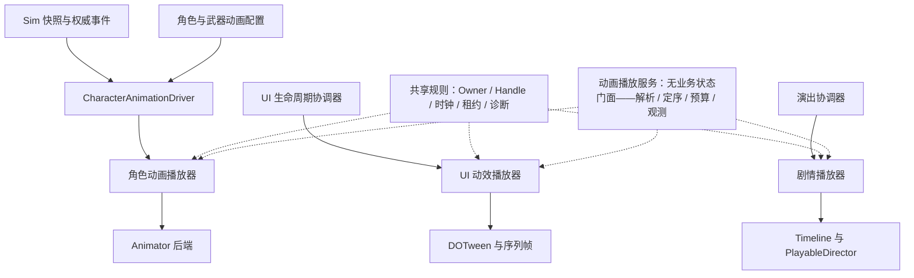

# 动画模块专项设计

> 状态：现行专项设计；播放契约与角色引擎后端、驱动层已落地，模块整体未完成（缺真对局动作对齐、上半身混合与 8 人基线，见 §13 末句）
> 版本：1.3
> 更新日期：2026-10-01
> 适用范围：角色骨骼动画、UI 动效、非对局演出及其时钟、资源、生命周期与生产验证
> Owner：客户端表现；客户端架构负责 Scope/内容契约，UI、玩法与工具 Owner 负责各自接入
> 依赖：分域时钟、内容服务与 AssetLease、作用域取消、Sim 公共快照/事件、角色资源与配置生成链
> 落地程度：本文定义播放契约的目标形态与分层纪律；各类型的实际落点与验证以 [Docs/施工进度/客户端表现基础.md](../../../施工进度/客户端表现基础.md) 为准。角色驱动层（状态机形态裁决）的权威设计见[层次动画机设计](层次动画机设计.md)。

## 1. 定位与设计裁决

采用“共享时钟、资源和生命周期规则，按角色、UI、演出提供领域播放器”的结构。业务通过表现适配层发出语义请求，播放器管理视觉播放与引擎对象。扩展点集中在动画配置、播放后端和明确的表现策略。

- 跨域 Scope、内容服务、关闭顺序遵循[客户端总设计](../../architecture/商业级通用客户端框架总设计.md)，动画模块不另建资源加载器或作用域系统。
- 玩法合法性、动作阶段、伤害和位移遵循[角色状态与动作专项](../../gameplay/角色状态与动作专项设计.md)及[动作与特效专项](../../gameplay/动作与特效专项设计.md)。Sim 不依赖动画播放器或 Unity。
- UI 打开/关闭、输入、导航、实例/展示作用域遵循[UI 总设计](../ui/UI框架总设计.md)。本文定义动画完成、取消和属性恢复的接缝，不改写页面状态机。
- Timeline 制作、整数帧导出与数值字段单源由[动作与特效专项](../../gameplay/动作与特效专项设计.md#5-timeline-编辑与导出)维护；本文只定义播放端和表现编排边界。
- 施工依赖以[项目待办总览](../../../待办总览.md)为准；测试层级与完成定义以[测试开发框架总设计](../../quality/测试开发框架总设计.md)为准。

| 待裁决问题 | 当前目标选择 |
| --- | --- |
| 是否统一为一个 AnimationManager 和万能 Play API | 共享必要的结果、所有权和诊断规则；角色、UI、演出保留各自领域接口 |
| 首版角色后端 | Animator Controller / BlendTree 制作，AnimatorControllerPlayable 承载，手动 PlayableGraph 统一驱动 |
| 是否立即自建动画状态机编辑器或复杂混合系统 | 先验证一个完整角色；直接 Clip 混合、IK 和专用后端按明确消费者扩展 |
| 动画结束是否决定业务完成 | 只表示视觉播放结束；业务结果由 Sim、UseCase 或 UI 协调器决定 |
| 现有 GameTimeline 是否升级为通用动画系统 | 保留定时回调职责；不承诺姿态混合、状态重建或权威动作执行 |
| 当前 SetUpdate(true) 是否等于 UIClock | 不等价；必须由 UI 动效适配层明确接入项目 UIClock |
| 是否允许任意状态机回退、补播事件 | 精确采样是后端能力；进度校正默认不重放一次性副作用 |

## 2. 当前实现状况

播放契约（`Core/Animation`，零引擎依赖）、角色引擎后端（`AnimationLayerMixerPlayable` 三通道分层混合 + 单次驱动）、驱动层（显式层次状态机形态裁决）、开火链路与根位移烘焙链均已落地；缺真对局动作对齐、上半身混合与 8 人基线。**上半身混合/真对局动作对齐/8 人基线未过前不宣布动画模块完成**。详细证据见 [Docs/施工进度/客户端表现基础.md](../../../施工进度/客户端表现基础.md)。

下表为代码与文档核对快照（可对照真实类型与文件，不运行 Unity 动画场景或 Player 验收）。

| 范围 | 当前事实 | 需要补足 |
| --- | --- | --- |
| [IGameClock](../../../../Assets/LiteFramework/Scripts/Core/Clock/IGameClock.cs)、[GameClock](../../../../Assets/LiteFramework/Scripts/Core/Clock/GameClock.cs) | 已有 WorldClock/UIClock、Paused、TimeScale、ScaledDelta；GameClock 裁剪单帧 delta，注释约定 Unity Time.timeScale 保持 1 | 动画后端统一驱动；不能把裁剪后的累计 Now 当作网络动作权威时间 |
| [TimelineRunner](../../../../Assets/LiteFramework/Scripts/Core/Clock/TimelineRunner.cs) | 已有按注入时钟执行回调的 GameTimeline；向后 Seek 不回退已执行动作游标 | 明确定时回调工具与姿态播放、Sim 动作轨的职责边界 |
| [UiFx](../../../../Assets/LiteGame/UI/Anim/UiFx.cs) | DOTween 原语与 UiFxHandle 复位句柄已有，UIClock 轨已落地（SetUpdate(Manual) 经 DotweenUiClockDriver 派发）；转场策略代码仍直用 DOTween | Owner/代次、槽位仲裁与统一终态归 [UI 效果系统专项设计](../ui/UI效果系统专项设计.md)；转场直用 DOTween 收编归其 E3 批次 |
| [Strategies](../../../../Assets/LiteGame/UI/UIStrategies.cs) | ToTask 区分终态（OnComplete→Completed；OnKill 只兜底不覆盖）；复位走 `Complete()`+`Kill(false)`；壳层感知页面回收主动取消 | 输入由协调器裁决 |
| [AnimatedImage](../../../../Assets/LiteGame/UI/Widgets/AnimatedImage.cs) | 已有序列帧，Update 直接读取 Time.unscaledDeltaTime | 接入 UIClock，统一停播、复位与单一更新入口 |
| [SimCombatRuntime](../../../../Assets/LiteSim/Core/Scripts/SimCombatRuntime.cs) | ActionRuntime 已有 ActionId/StartFrame/Phase/CastToken；公共动作摘要为前三项 | Driver 消费已公开事实；不能假定内部 CastToken 已复制给远端 |
| 角色与演出播放器 | `Core/Animation` 契约、`AnimatorAnimationBackend`（分层混合与单次驱动）、驱动层状态机、`AnimationProfile` 与帧事件接缝均已落地；角色资源主源为 `Assets/CombatGirlsCharacterPack/`（RifleGirl 模型 + `Rifle_Controller` + Idle/Walk/Run/Hit/Die/Reload/Aim 全套，Avatar 主源 `Humanoid_F.fbx`），真角色视图 prefab 已接入对局 | 真对局动作对齐、上半身混合、8 人基线与 Player 验收场景 |

已有 VFX 的句柄和异步请求登记方式可以参考；动画仍需自身的实例代次、通道和资源所有权。UI 或 VFX 已能运行不能作为角色动画已实现的证据。

## 3. 分层、输入输出与代码归属



| 层 | 输入 | 输出与职责 | 扩展点 |
| --- | --- | --- | --- |
| CharacterAnimationDriver | 快照、权威事件、明确允许的本地预测反馈、当前呈现帧 | 将角色语义解析为参数与播放请求；不改 Sim | 不同角色类型的适配策略 |
| Profile/Resolver | 动画 ID、角色/武器配置、可用后端能力 | 已验证的状态/资源/通道/混合方案 | 新角色和武器主要扩展配置 |
| 角色播放器 | 已解析请求、参数、Owner 状态、时钟输入 | Handle、终态、通道占用、后端控制、播放诊断 | 小型仲裁策略与能力接口 |
| 引擎后端 | 已接受的状态切换、参数与采样命令 | 姿态、引擎对象释放、受控表现标记 | Animator；后续直接 Clip 混合等 |
| 表现编排层 | 已去重的表现事件与视觉标记 | 调用 VFX、Audio、镜头等独立服务 | 受控事件处理器 |
| UI/剧情播放器 | 各自协调器的播放意图与绑定对象 | 领域播放结果、视觉更新、停止清理 | UiFx 原语、转场策略、Timeline 绑定 |

**动画播放服务化（状态/播放解耦裁决）**：业务状态与播放机制分离——**服务无业务状态，只提供播放 API 与登记/定序/预算/观测**；语义状态机留在 Owner。三层归属：

| 层 | 归属 | 内容与边界 |
| --- | --- | --- |
| 业务状态（"该播什么"） | Owner 侧（Driver/Stage 状态机） | 根裁决（死亡>换弹>开火/瞄准）、Locomotion 三态、换弹事实清除、转场语义——服务与播放器均不认识任何玩法词汇 |
| 播放 API（"怎么播"） | 无状态服务门面 | §5 的 `IAnimationPlayer` 契约即服务 API 面（Play/PlayBlend/Stop/TryGetState/终态/能力位）；按 Owner 解析播放器；按实体查询通道占用；全局播放开关 |
| 机械上下文 | 服务内部（对 Owner 不可见） | 每 Owner 引擎图、在途淡入权重、事件跟踪——只经 Handle 引用；随 Owner 销毁归还（**无业务状态 ≠ 可泄漏**） |

裁决要点：

1. **"无状态"的准确口径＝无业务状态**。淡入进度、层权重这类机械状态物理上必须存在——装进 Handle 与图上下文，不进服务单例的域字段；
2. **仲裁切两半**：通道仲裁（同通道抢断/有界保留——机械规则，§6）在播放器内（经服务解析获得）；**根裁决（语义优先级）永远留 Driver/Stage**——服务不得认识技能、死亡、换弹词汇；
3. **Owner→播放器解析与生命周期归服务**：创建/复用/销毁收口（图随 Owner 归还池），更新次序与预算由服务统一定（§7"由框架确定唯一入口"的落点在此，不再散在装配根）；
4. **跨域统一发生在 API 概念与观测层，不发生在播放吸收**：角色（Animator 后端）、UI 动效、剧情 Timeline 可注册进服务的定序/预算/观测聚合面；**分域时钟语义留在各域后端**（§7 时钟表——服务不统一时钟）；UI 播放细节以[UI 效果系统专项设计](../ui/UI效果系统专项设计.md)为权威——`UiFx` 保持"全项目唯一 tween 出口"裁决，接入形态为**对齐 Handle/Owner/终态概念后挂进服务观测面**，不另建第二出口、不被服务吸收；
5. **与现状的关系**：Core 契约层与引擎半部（LayerGraph/ChannelNode/ChannelBlendAdvance/LayerMixerPlayable/后端编排）**全部保留复用**——改造面只在装配与接线（驱动从"自持后端组件引用"改为"经服务解析播放器"），§5 目标契约不需要重定义。

每个 Graph、Tween 和绑定资源都必须能追溯到 Owner。

目标目录按职责组织，**与当前实现一致**（下述路径即当前落点）：

```text
Assets/LiteFramework/Scripts/Core/Animation/          播放契约（零引擎依赖）
    AnimationSemantics.cs   语义 ID / 通道 / 通道掩码
    AnimationRequests.cs    播放与混合请求
    AnimationResolved.cs    已解析方案（后端只认这个，不认 ID）
    AnimationPlayback.cs    句柄 / 终态 / 状态快照 / 启动结果
    AnimationDefinition.cs        单片段定义（登记数据，不可变共享）
    AnimationBlendDefinition.cs   混合定义（槽位集合登记面）
    AnimationProfile.cs           注册表与解析（回退链限深禁环 + FallbackPolicy）
    AnimationBackendCapabilities.cs  后端能力位（跨层判据面：播放器拒绝依据 / 后端诚实声明 / 测试断言）
    IAnimationBackend.cs          后端契约（只管接口，能力位不在此）
    CharacterAnimationPlayer.cs   通道仲裁、句柄三分量、终态恰好一次
    ClipCompletionTracker.cs      结束边界判定（纯逻辑，可假时长单测；ClipTickAction 是其输出面，同件）
Assets/LiteView/Animation/                        表现层实现（Unity 类型不出本层）
    Drivers/    CharacterLocomotionDriver（事实喂入器：测速/锁存/事件路由/槽位生命周期/诊断）、
                LocomotionBlendMath（速度锚点与迟滞公式）
    Backends/   AnimatorAnimationBackend（编排 + 能力位 + 诊断聚合——**Clip 直驱、控制器可选**）、
                AnimationLayerGraph（固定 6 输入拓扑；默认姿态位可选——控制器存在才占基础层）、
                ChannelNode（节点两形态 + 通道运行态）、ChannelBlendAdvance（层权重推进与回收）、
                UpperBodyMaskFactory、AnimationChannelDebug
    Profiles/   CharacterAnimationIds（Profile 登记用的 id 常量）、CombatGirlsAnimationProfile（绑定与循环策略登记）
    Combat/     CombatAnimMachine（单机双根层次状态机装配）、CombatRootStage / CombatLeafStages（战斗根与四叶）、
                LocomotionRootStage / LocomotionLeafStages（移动根与两叶）、SlotAnimContext（槽位窄上下文）
    FrameEventAnimationSeam.cs   帧事件 → 动画请求的接缝（消费者接口；映射＝状态机转换条件）
Assets/LiteGame/UI/Anim/                              UI 动效（UiFx / UIClock 适配 / 转场策略——独立领域）；播放统一收口见 [UI 效果系统专项设计](../ui/UI效果系统专项设计.md)（LiteGame/UI/Effects/ 为其目标落点）
Assets/LiteGame/Editor/Animation/                     有校验消费者后再建（Profile、Controller、资源引用与预览校验）
```

**分层纪律**：`Core/Animation` 是零引擎依赖的契约与纯规则（`LiteFramework.Core.csproj` 源链接进 L1）；引擎对象（Animator/PlayableGraph/AnimationClip/AvatarMask）只出现在 `View/Animation`；UI 动效（DOTween/UniTask）留在 `LiteGame/UI/Anim`，不并进 Core（两者只有"Owner/Handle/终态"概念同源，不共享类型）。

所有 Unity 类型留在 Unity/View/Shell 层。纯规则可以单独抽取测试，但不能为了接口共享把 Animator、AnimationClip、DOTween 或 UniTask 引入 Sim/Core。先建立文件与依赖边界，实际复用稳定后再提取程序集和包。

## 4. 动画定义与配置单源

`AnimationProfile` 是只读定义，播放实例另存当前位置、层权重、Handle 和结束状态。制作端可以使用 ScriptableObject，运行时消费校验后的数据，不在共享资产上存角色状态。

| 配置 | 约束 |
| --- | --- |
| AnimationId | 稳定语义 ID；Idle/Reload/Death 等枚举或常量由游戏层定义，框架只处理类型化 ID |
| BackendBinding | **绑定键（已实现为 Clip 资源键分支）**：片段名（控制器存在时自动索引）/ 外部登记键（`RegisterClip`——直 Clip 模型）；统一校验和生成 Hash |
| Parameters | 明确 ID、类型、范围及默认值；不得到处散写参数字符串 |
| Channel | 配置使用已声明通道，Mask/层次与冲突关系显式 |
| Blend | 淡入淡出、层权重、循环、允许速度范围；零/负/非有限值按字段规则校验 |
| TimePolicy | 自由播放、动作阶段对齐或显式采样；不把不支持的能力静默降级 |
| VisualMarkers | 受控标记 ID、时点和循环策略；不存伤害/扣弹/玩法回调 |
| Fallback | 缺失定义或资源时拒绝、回退或保持已有姿态的明确策略；限制回退深度，禁止环 |

角色变体采用基础 Profile 加受限覆盖槽位。武器覆盖持枪姿态或上半身动作，不复制完整状态机；覆盖顺序固定并由工具展示最终解析结果，避免深层配置继承。

**片源载体裁决（2026-10-09，随多形态档案路由批落地）**：直 Clip 形态（去 AC 后的主路径）的片源走**纯配置**——**独立 ScriptableObject 清单资产**（键 → `AnimationClip` 显式引用）为唯一载体；键单源仍在 Profile，装载经统一内容服务（AssetLease/代次，§9），装配期逐键 `RegisterClip` 入后端并经校验后才放行播放。**不采用**视图 prefab 上的 MonoBehaviour 拖拽配置（配置随不入 VCS 的 prefab 漂移，且绕开装载与校验面）；控制器片段索引与组件拖拽仅保留为可选便利源/局部例外（视图私有、单实例、不需热更换的小物件）。

**混合（同通道多片段按权重）的定义与解析**：集合形态——槽位绑定与次序——由 Profile **登记固定**，权重只调比例、**不增删槽位**；因此槽位数能在解析期与后端固定图容量对齐（`MaxBlendSlots` 与首个后端的 `MaxBlendInputs` 同源，§12 节点有界）。**权重由 Driver/消费者按当前呈现状态给出**，播放器只做整组校验与通道仲裁（§6"业务优先级由 Sim/Driver 解释"）。同一 ID 不得同时登记为单片段与混合（解析形态不可歧义），混合 ID 不参与单片段回退链。混合集合**恒为循环形态**（无单一结束边界 ⇒ 永不 `Completed`），故**槽位应当是循环片段**（首版不逐输入强制回绕：一次性片段在混合里会停在末帧）。

`tb_action_num` 等玩法表继续决定前摇、生效、后摇和冷却。动画只定义如何适配这些阶段，例如调整片段速度、阶段位置映射或持有姿态。动画时长不反向覆盖玩法时长。参与一局的配置与内容版本由对局上下文固定，不在播放中替换底层定义。

## 5. 播放接口与结果契约

以下是目标 API 形态，不是当前可调用代码；具体类型需随首个消费者收敛。接口避免暴露后端的 Tween、Animator 和 PlayableGraph 给业务。

```csharp
public interface IAnimationPlayer
{
    AnimationStartResult Play(in AnimationRequest request);
    bool Stop(AnimationHandle handle, AnimationStopReason reason);
    bool TryGetState(AnimationHandle handle, out AnimationPlaybackState state);
}
```

- Owner 在创建播放器时绑定。`AnimationRequest` 包含 AnimationId、目标通道、受约束的混合选项和开始位置；业务不能传任意资源路径绕过 Profile。
- `AnimationStartResult` 区分接受与拒绝。拒绝返回 InvalidDefinition、UnsupportedCapability、CapacityExceeded、OwnerUnavailable 等可诊断原因，不改变现有播放。
- 接受后立即分配 Handle；即使资源随后加载失败，该 Handle 也必须得到唯一终态。默认预加载常用动作集；运行时加载路径仍需有界、可取消。
- `AnimationHandle` 至少能验证播放器身份、Owner 代次与请求身份。旧 Handle 不能停止复用对象的新播放，重复 Stop 不重复通知。
- 连续参数更新、受控状态校正与精确时间采样按实际需要提供独立接口。通用 Play 不承诺任意 Animator 状态图 Seek 或历史恢复。
- 结束订阅属于 Owner；可提供低频 await 适配，但每帧参数更新不创建 Task、闭包或字符串。
- 终态记录采用有界保留；过期后 TryGetState 返回未找到，不能把所有已完成 Handle 永久留在全局表里。
- **混合面（同通道多片段按权重）走独立请求类型**（`AnimationBlendRequest` → `PlayBlend`），不塞进通用 Play 的参数堆：槽位权重由 Driver 给、绑定由 Profile 解析，二者在播放器里汇合成**唯一入口**（不存在绕过播放器的裸绑定 API）。混合播放与单片段**共用同一套通道仲裁**，但**永不 Completed**，也不能因能力位缺失而降级成单片段播放。

| 终态 | 含义 |
| --- | --- |
| Completed | 满足定义的视觉结束条件，或经过同一终态流程的即时/关闭动画策略 |
| Interrupted | 被接受的新播放或表现接管替换 |
| Cancelled | 调用方主动取消 |
| OwnerDisposed | 所属角色、展示作用域或场景结束 |
| Failed | 已接受请求在加载、绑定或后端执行中失败；带稳定错误码 |

一个已接受请求只产生一次终态，回调重入不能让旧请求再次结束或写回新实例。循环播放不会自然 Completed。OnKill 不是完成信号；正常完成后自动 Kill 也不能把 Completed 覆盖为 Cancelled。

Completed 的判定方式必须写入定义：一次性受控状态到达结束边界、序列完成或外部明确结束。不得笼统地以 Animator.normalizedTime >= 1 推断所有 BlendTree、循环或过渡完成。Gameplay 不等待这个终态推进事实。

生命周期取消不依赖播放时钟。用于发现卡死的超时使用独立单调时间源，并明确主动暂停是否计入超时；正常暂停不能被误判失败，Scope 释放也不能因暂停无限等待。

## 6. 通道仲裁与单一写入责任

角色首版按消费者设置基础移动、上半身动作、全身动作通道；瞄准附加层在垂直切片需要时加入。通道之间的 Mask、覆盖和混合关系由 Profile 固定。

业务优先级由 Sim/Driver 解释；播放器只解决视觉通道归属。死亡到达后，Driver 撤销换弹表现并请求全身死亡，播放器不自行判断角色是否还允许换弹或扣弹。

- 首版每通道最多一个待提交请求和一个当前逻辑播放，不默认建立动作队列；淡入淡出的旧姿态仍可短暂存在，由同一后端管理并计入预算。
- 请求先验证定义、能力和资源，再原子提交到目标通道。提交前失败保持原播放；多通道请求必须整体取得所需通道，不能只占一半。
- 替换加载中的请求必须终止旧待提交 Handle；迟到加载结果只释放自己的资源，不抢回通道。
- 多次快速打断的混合尾部必须有固定上限和确定截断策略，不能无限累积过渡状态。
- 骨骼分层允许由同一后端组合多个姿态；禁止多个无协调系统各自写同一 Animator 或 Transform。
- UI 的布局、拖拽与转场不能竞争同一属性。优先使用布局外层/动效内层结构；确需共享属性时按显式所有权交接。
- Timeline 接管角色时，由协调器暂停或替换原播放器的输出；结束后根据当前业务状态重建姿态，不恢复已经过期的旧动作。

## 7. 时钟、更新次序与网络进度

| 场景 | 时间依据 | 处理方式 |
| --- | --- | --- |
| 环境与自由角色循环 | IWorldClock | 后端消费已缩放的 ScaledDelta，不再次乘世界 TimeScale |
| UI 转场、滚动数字、序列帧 | IUIClock | 由 UI 动效适配层消费其暂停、变速和 delta |
| 联机动作 | 当前呈现帧、权威 StartFrame/Phase 与玩法时长 | Driver 计算目标阶段进度，后端执行受控校正 |
| 非对局演出 | 演出配置声明的时钟 | Director 由唯一驱动器推进，停止和快进遵守表现标记策略 |

概念上的更新次序为：更新分域时钟 → 读取快照/插值/预测的呈现状态 → Driver 解析参数与目标进度 → 提交播放/取消 → 后端计算姿态 → 挂点/表现事件处理。实际 PlayerLoop 和 LateUpdate 接缝在真实角色用例验证；由框架确定唯一入口，不能一边组件 Update、一边集中 Tick。

自由播放可以累计 WorldClock；联机动作不能用裁剪后的 GameClock.Now 推断权威进度。固定时长动作可从“呈现帧减 StartFrame”映射到阶段位置；远端使用插值呈现帧，本地明确区分预测移动与权威动作。中途改变动作速率或暂停阶段时，需由玩法契约提供可重建的权威时间信息，不能只靠动画侧猜测。

角色后端为 **Clip 直驱**（绑定键→`AnimationClip`→片段 Playable 直连分层图；§4「Clip 资源键」分支），PlayableGraph 采用 Manual 更新。**RuntimeAnimatorController 可选**：存在时①占图基础层作开局默认姿态（首帧不露 T-pose）②其片段自动按名索引（便利源）；缺失时（**直 Clip 模型**——带片段、无控制器资产）无默认姿态位，片段经 `RegisterClip` 外部登记（T-pose 由驱动层"机 Start 即提交 MoveBlend(Idle=1)"的同帧落位兜底；驱动层"缺控制器跳过"的灰盒策略暂不变，多形态档案路由批再放开）。层权重、播放和采样集中在后端，Graph Evaluate 只由一个驱动器调用。动作本身的播放速度与时钟缩放分别有明确归属，避免重复缩放。零 delta 时仍须处理停止、销毁和必要的显式姿态校正。

SetUpdate(true) 只声明 Tween 独立于 Unity timeScale，不会读取项目的 UIClock。UI 适配器应登记顶层 Tween/Sequence 并按 UIClock 手动驱动；采用实例级推进前核对本地 DOTween API 并验证 Sequence 行为。若使用全局 DOTween.ManualUpdate，必须限定统一更新域，不能让 World 和 UI 各调用一次驱动同一批 Tween；父 Sequence 与子 Tween 也不能分别推进。

角色驱动层的形态裁决（层次状态机、覆盖与退根规则）以[层次动画机设计](层次动画机设计.md)为权威；本文只定义时钟与更新次序的接缝。

## 8. 表现事件、恢复与 Root Motion

动画标记只传递受控视觉通知，例如脚步、弹壳或模型挂点切换。表现编排层把它们路由到 VFX、Audio、相机等服务，骨骼后端不直接引用这些服务，更不能调用 Sim 扣血或改变库存。

- 伤害、生效窗口、弹药提交、取消资格由 Sim 整数帧规则产生。修改动画长度、禁用动画或降低动画更新频率不能改变这些事实。
- 持续表现从当前快照重建；一次性效果按稳定事件键去重，遵守现有 silenceUntilFrame 和恢复规则。脚步等循环标记还需定义循环次数、跨帧和落后处理策略。
- Seek、重连和和解默认只恢复姿态与持续效果，不补播越过的全部音效、粒子。编辑预览若允许补播，必须是显式模式。
- 事件键包含足以区分实体复用和动作实例的信息。可用现有公共动作摘要建立受约束的本地识别；不能假定 CastToken 为公共字段。若现有信息无法消除碰撞，先明确协议新增字段，再补 CopyTo、序列化、差分、checksum 与重连测试。
- 本地即时开火反馈与权威确认必须有合并规则，不能先预测播放一次、收到确认又重复播放一次。
- 去重缓存按帧窗口和容量淘汰；容量不足必须计数诊断，不能无限保存历史事件或静默影响玩法处理。

**帧事件 → 动画请求的接缝**：事件在**逻辑帧边界**由 `RollbackSim.OnFrameEvents` 交付，经 `SimView.OnFrameEvents` 的**静默门**（回滚重放/和解段不重播一次性副作用）放行；动画侧消费者接在静默门之后（`LiteView.Animation.IFrameEventAnimationConsumer`）。**不设独立决策表**：语义与通道即状态机的转换条件，由战斗层装配期从 Profile 单源解析（见[层次动画机设计](层次动画机设计.md)）。

消费纪律：主体 → 实体槽位（`SimView.TryGetSlot`）→ 该实体播放器；本地即时反馈与权威确认必须合并（"不能先预测播放一次、收到确认又重复播放一次"——静默门是结构性保证）；战斗动作全走 **FullBody** 通道，进入前先收移动根的 Locomotion 通道（事务序先停后播）；**Fire 事件只刷新射击窗**——开火不播专用片段（Fire 族持 `AimIdle`/`AimMoveBlend` 循环，事件不触发重提交；射速节拍归 `WeaponSystem`）。换弹/瞄准不由帧事件驱动（它们是 Sim 动作阶段/输入事实，走快照消费——瞄准走 `EntityFlags.Aiming`、换弹走 `SimView.IsReloading`）；消费方不得回写 Sim。

连续状态位口径：瞄准由 `EntityFlags.Aiming`（每帧覆写的连续位）承载；开火态由 `EntitySlot.FireStanceFrames`（射击窗，公共快照字段）承载，无独立 `Firing` 位。

联机角色的权威根节点由 Sim/预测呈现控制，动画默认不通过 Root Motion 或 OnAnimatorMove 回写根位移。确需动画驱动位移时，把曲线导出为经过验证的玩法数据，由 Sim 执行；视觉子节点可做有限补偿并在结束/回收时复位。非权威演出的 Root Motion 需要显式授权与独占绑定。

联机位移来源、烘焙数据、受阻处理、滑步与测试的细化方案见[联机动画与根位移专项设计](联机动画与根位移专项设计.md)；该文目前为草案，不改变本文已实现范围。

## 9. 资源、Owner 与池化

Owner 复用框架既有作用域契约：角色播放器属于实体表现生命周期，UI 动效属于展示作用域，剧情属于演出/场景作用域。AssetLease 来自统一内容服务，动画模块不持有无法追踪的裸加载结果。

- 常用 Controller/Clip/Profile 集合在角色准备阶段加载和校验。等待资源时可保留已存在的姿态或使用配置化回退；动画加载失败不阻塞 Sim。
- 播放集合、在途加载和共享资源持有者均有清晰引用关系。资源最少持有至使用它的 Graph/Tween/演出绑定解除之后，不能在对象仍引用资产时提前释放租约。
- 销毁顺序：使 Owner 代次失效并停止接受请求 → 取消加载/播放并确定终态 → 撤销更新和标记订阅 → 销毁引擎对象/解除绑定 → 释放租约。
- 无法取消的底层加载仍须在完成时检查代次；迟到结果释放自己的租约，不能回写已回收对象。
- 池化区分展示期、实例驻留期。隐藏/禁用必须停止展示期播放；需要保留的预热资源由实例驻留期明确持有，在淘汰时释放。
- 复用时重置参数、层权重、播放状态、标记游标、视觉偏移、临时 Mask/绑定和 UI 属性基准。只 Kill Tween 或只 SetActive(false) 不构成完整复位。
- Profile 或内容更新先校验候选版本，再发布给新的 Owner；现存对局/播放持有一致版本，不把全局缓存先清空后重新加载。发布身份、ContentGeneration、激活与恢复遵循[热更与内容发布专项设计](../content/热更与内容发布专项设计.md)，加载/缓存键包含代次；后端尚不能证明多版本并存时采用完整释放后的安全窗口切换。

## 10. UI 与剧情接入

UI 动效/粒子/音效的统一收口（播放契约、定义、编排、槽位仲裁与预算）以[UI 效果系统专项设计](../ui/UI效果系统专项设计.md)为权威；本文保留播放终态映射、时钟接缝等跨域通用规则。UiFx 原语专注视觉效果，迁移期可以保留内部返回 Tween 的旧调用，但页面业务不应继续增加直接操纵 Tween 的依赖。

播放终态与 UI 操作结果分层映射：正常播放对应 Completed；主动跳过可先不创建播放并由 UI 返回 Skipped；超时先取消和清理播放再由 UI 返回 TimedOut；OwnerDisposed 对应失效展示的取消。Interrupted 不自动代表页面成功，必须由当前 UI 操作判定是替换、取消还是失败。UI 总设计定义的结果枚举保持有效，不用底层播放枚举直接替换。

UI 协调器决定页面存在性、输入锁、射线阻断与焦点。动画正常完成、取消或失败后，协调器根据当前操作和展示代次处理收尾；过期 OnComplete 不能重新打开已关闭页面的交互。缩短/关闭动画仍经过同一操作和终态流程。恢复属性时还需验证当前写入权，旧动画不能把新动画的值重置掉。

AnimatedImage 与 Tween 使用同一 UIClock 语义，禁用/隐藏/复用时有确定停播和复位行为。高频变化由 C# 更新，不通过每帧 Lua 请求驱动动画。

非对局演出可使用 Timeline/PlayableDirector，拥有明确绑定表、时钟、资源租约和停止路径。快进/跳过只能通过演出协调器提交剧情结果，不能依赖动画事件把所有越过的业务回调再执行一遍。对局内的权威动作继续执行导出的 Sim 指令，表现序列只负责显示，遵循动作专项的制作和导出契约。

## 11. 编辑器校验与诊断

首批工具围绕实际 Profile 和角色资产建设，不先制作完整自定义状态机编辑器。

必需校验包括：动画 ID 唯一性、资源键有效性、Controller 状态/层/参数类型、Avatar/Mask 适配、覆盖顺序、循环与结束条件、合法时长/速度、预期 Root Motion、后端能力、标记白名单、回退环及跨通道冲突。每类规则至少有一个会失败的负例。

预览允许切换角色/武器、显示解析后的 Profile、模拟 World/UI 暂停和变速、查看阶段映射。预览成功不替代运行时取消、池化和联机恢复测试。

播放诊断至少显示 Owner/代次、Handle、AnimationId、通道、定义版本、后端、当前状态/目标进度、时钟、在途加载和最近终态。模块统计接入现有 IModuleStats；对解析、Graph 计算、标记、取消与清理设置可采样的性能观测点，稳定帧不持续分配日志字符串。

## 12. 容量与性能预算

下表是首版约束和待实测指标，不是已经达成的性能结论。绝对毫秒/内存目标在 G2 用目标 Player、角色资源和 8 人场景建立基线后，写入性能配置与验收产物。

| 项目 | 首版约束/测量口径 | 超限处理 |
| --- | --- | --- |
| 通道请求 | 每通道一个待提交、一个当前逻辑播放；无默认无界队列 | 按替换策略结束旧请求，或在接受前明确拒绝 |
| 混合与 Graph | 明确每角色状态/节点/过渡尾部上限，反复打断后节点数稳定 | 截断低优先级混合尾部并计数，不影响业务事实 |
| 加载与资源 | 内容服务的并发/内存预算，按 Profile 集合统计租约 | 有界等待、回退或 Failed，不无限积压 |
| 标记与去重 | 固定帧窗口、缓存容量和单帧处理量 | 合并/丢弃可丢视觉事件并记录；不得丢玩法指令 |
| 稳定帧分配 | 框架自有参数更新、调度与去重路径目标 0 B GC/frame | Profiler 定位；引擎/第三方开销单独归因 |
| CPU 与可见性 | 记录不同可见人数、混合层数下的分位耗时 | 降低非关键姿态更新频率，事件与生命周期继续推进 |
| 清理 | 反复进出/池化后活动 Handle、Graph、Tween、租约回到预期基线 | 用持续增长判定失败；区分允许的驻留缓存 |

离屏剔除或降频不能让请求永久不结束。可恢复姿态根据绝对呈现位置采样；其他播放的逻辑进度、超时和 Owner 清理独立于渲染可见性，恢复可见后不集中补播副作用。

## 13. 测试与验收

| 层级 | 覆盖内容 | 必须验证的结果 |
| --- | --- | --- |
| L0 | 依赖方向、资产/定义静态检查、生成一致性 | Sim 无 Unity/动画依赖；非法 Profile 和玩法标记被拒绝 |
| L1 | Resolver、覆盖顺序、通道提交、Handle 代次、终态与事件去重的纯规则 | 失败不抢占；终态恰好一次；旧请求无写入权；容量受限 |
| L2 EditMode | 真实 Controller/Profile/Clip/Mask 引用及导出/校验负例 | 错误可定位到资产、字段和规则；目标后端能力吻合 |
| L2 PlayMode | 真 Animator Graph、UI Tween/Sequence、序列帧、Owner、租约与池化 | 单一驱动、分域暂停、取消复位、迟到加载和资源清理正确 |
| L3 | 无头联机、动作摘要/事件与重连数据集成 | 进度所需事实可重建；事件身份稳定；有无表现消费者不改变 Sim 结果 |
| L4 / Player | 目标设备长跑、IL2CPP、8 人表现负载、离屏/低帧率 | 性能基线达标，无持续资源增长或可见性引发的悬挂请求 |

真实 Unity 客户端的联机姿态、预测/确认不双播及重连表现由 L2 PlayMode 场景和 Player 联合验收，无头 L3 不替代视觉验证。首个角色至少覆盖待机、移动、瞄准、开火、换弹、受击、死亡及上半身混合。还必须验证以下故障与竞态：

1. 世界暂停而 UI 正常；UI 自身暂停后 Tween 和序列帧同时停止，恢复后不重复推进。
2. 换弹被死亡打断只有一次终态，Sim 结果不取决于动画是否播放。
3. 旧播放在对象回收后完成/加载返回，不影响新代次；重复 Stop 和回调重入安全。
4. 新请求缺资源或不支持能力时保持已有姿态；释放过程中不会新增 Graph。
5. 正常完成后自动 Kill 不改变结果；取消和关动画都能释放 UI 输入锁并正确复位。
6. 低帧率、重连和进度校正后姿态可恢复，越过的一次性标记不会成批补播。
7. 角色不可见时仍能取消/结束，恢复可见后跟随当前状态；Graph/租约反复循环不增长。

测试报告注明 Unity/后端版本、资产与内容版本、设备、场景、退出码和产物。没有真实角色与 Player 证据时，不以接口和单元测试齐全宣布动画模块完成。

## 14. 现有代码改造清单

| 位置 | 处理 | 保留与迁移边界 |
| --- | --- | --- |
| UiFx.cs | UIClock 适配已落地；Owner/代次、槽位仲裁与统一终态随 [UI 效果系统专项设计](../ui/UI效果系统专项设计.md) E1/E2 承接 | 保留已用动效原语与“完成态即基线”复位契约，调用方分批迁移 |
| UI/Strategies.cs | 区分 Complete/Kill；交互裁决交回 UI 协调器；校验回调代次 | 保留转场策略扩展点，配合 UI U1 实施 |
| AnimatedImage.cs | 使用 UIClock，统一停播/复位和更新入口 | 保留现有序列帧素材和组件制作方式 |
| Clock/TimelineRunner.cs | 澄清定时回调与 Seek 的能力边界 | 保留既有调度用途，不承担骨骼播放或 Sim 指令 |
| LiteFramework/Scripts/Core/Animation | 播放契约与纯规则（`LiteFramework.Animation`，按类型族分件） | 零引擎依赖；Unity 类型不进来 |
| LiteView/Animation | Driver（事实喂入/事件路由）、层次状态机（`Combat/`）、权重数学（`LocomotionBlendMath`）、Animator 后端（**Clip 直驱、控制器可选**——编排/拓扑/节点/推进分件）、Profile 解析、帧事件接缝 | 消费公共快照/事件，不更改 Sim 判定或默认扩张协议 |
| View/Animation 装配与驱动接线 | 播放服务化（状态/播放解耦）：驱动经服务解析 Owner 播放器（门面收口解析/定序/预算/观测），不再自持后端组件引用 | 引擎半部（LayerGraph/ChannelNode/推进分件）全部保留复用——只改获取与生命周期接线，调用方分批迁移 |
| 内容/Scope/游戏入口 | 接入租约、代次、更新顺序与逆序关闭 | 复用客户端 G1 成果，不增加第二套生命周期 |

## 15. 分阶段施工路径

表中批次为规划，不构成完成证据；总体先后受 G0～G6 主路径约束，各批落的实际进度见 [Docs/施工进度/客户端表现基础.md](../../../施工进度/客户端表现基础.md)。

| 批次 | 依赖与归属 | 交付 | 退出条件 |
| --- | --- | --- | --- |
| 基础契约与 UI 接缝 | G1 / C1 / U1；分域时钟、Scope 与资源租约契约 | Owner/Handle/终态、UIClock 驱动、UI 取消复位、fake 后端与故障用例 | 分域暂停、重复停止、旧回调、迟到加载、清理全部可验证 |
| 角色垂直切片 | G2 / C2 表现；角色资源、玩法阶段与快照稳定 | 一个完整角色、Profile/Driver/Animator 后端、上半身混合和诊断 | 真资源联机动作对齐、打断、重连、池化和 8 人基线通过 |
| 播放服务化（状态/播放解耦） | 角色垂直切片余部稳定；首个服务级消费者（GM/诊断按实体查询、全局开关、预算观测） | 服务门面 + Owner→播放器解析 + 定序/预算/观测聚合 + 跨域后端注册面；驱动接线分批迁移 | 驱动层零引擎件引用、按实体查询与全局开关可用、次序与预算经服务、既有回归全绿 |
| 制作与演出扩展 | 消费者出现后纳入总体队列 | Profile 工具、Timeline 表现消费、可选 Clip 混合/IK/降级 | 每项有实际消费者、兼容验证、预算和回归用例 |

首版不承诺任意 Animator 图倒放、通用动画脚本语言、自研图编辑器或跨引擎统一姿态接口。能力升级依据真实消费者和当前后端不能满足的测试场景，不以接口数量衡量扩展性。

## 16. 维护规则

本文是动画播放契约的单一专项入口。其他文档引用本文，不复制 Handle、终态、时钟和后端规则。修改播放语义时，同批更新消费者、校验与测试；新增公共协议字段必须走网络/Sim 全链契约。

关联的角色、动作、UI 文档仍各自负责原领域。施工证据记入 [Docs/施工进度/](../../../施工进度/)，并回写本文现状。
