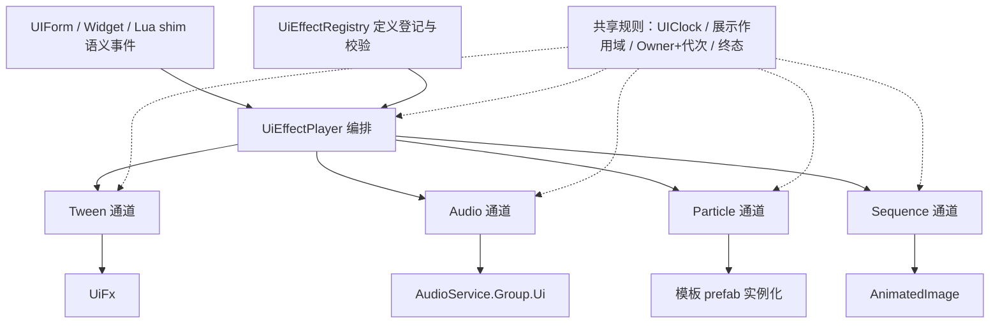

# UI 效果系统专项设计

> 状态：现行专项设计；目标契约尚未实施——UiFx/UIClock 适配/AudioService 为既有可复用件，统一契约、定义与编排层未开工（见 §2、§11）
> 版本：1.0
> 更新日期：2026-10-07
> 适用范围：UI 动效（Tween/序列帧）、UI 粒子、UI 音效的播放契约、数据化定义、编排、槽位仲裁、预算与验收
> Owner：客户端 UI
> 上位设计：[UI框架总设计](UI框架总设计.md)（页面生命周期、层序、操作协议）；概念同源：[动画模块专项设计](../animation/动画模块专项设计.md)（Owner/Handle/终态概念同源、不共享类型）
> 依赖：UIClock 分域时钟、展示作用域与展示代次、AudioService、视觉单一来源（模板 prefab）

## 1. 定位与裁决

UI 效果 = UI 层对一次语义事件的多通道表现响应，通道为**动画（Tween/序列帧）+ UI 粒子 + UI 音效**。本文是三通道统一播放契约的唯一专项入口；其他文档引用本文，不复制 Handle、终态、仲裁和预算规则。

设计纪律：系统按**完整生产形态**一次立全契约——数据化定义、可扩展通道、预算与降级、观测、测试面；实施按 §11 分批，但契约不分批残缺，不以"等消费者出现再补"的方式演进。

| 待裁决问题 | 裁决 |
| --- | --- |
| 是否统一为一个大类/万能 Play API | 否——契约统一（Handle/终态/时钟/作用域同源），通道分立接口；与[动画模块专项设计 §1](../animation/动画模块专项设计.md) 同源裁决，通道数量可扩 |
| 收口范围 | 动画、UI 粒子、UI 音效三通道及编排。**页面转场不收**（Runner 是页面生命周期语义，§7.4）；**世界 VFX 不收**（归表现服务，[动作与特效专项设计](../../gameplay/动作与特效专项设计.md)） |
| UI 音效归口 | `AudioService.Group.Ui` 为唯一底层；UI 层以语义键经音效通道接入，页面/控件不得直挂 AudioSource 或直摸 AudioService 组 |
| UI 粒子是否建独立服务 | 不建——粒子是效果系统的一个通道；视觉单一来源不变，粒子从 `Assets/UI` 模板 prefab 实例化 |
| DOTween 入口 | UiFx 保持唯一 DOTween 后端，效果系统是它的消费者；转场代码直用 DOTween 属待收编现状（§7.4、§11 E3） |
| 动效与数据争写 | 播放侧按槽位仲裁（§6）；数据写入所有权仍归页面/控件（总设计 §8.1 单一数据所有者） |
| Lua 暴露面 | 归 [UI控件LuaAPI参考](UI控件LuaAPI参考.md)；现有 Pulse/Flash/Slide shim 语义不变（§7.5） |

## 2. Current：可复用基础与未实现边界

| 既有件 | 现状 | 在系统中的角色 |
| --- | --- | --- |
| [UiFx / UiFxHandle](../../../../Assets/LiteGame/UI/Anim/UiFx.cs) | 四原语 Pulse/Flash/Slide/CountUp；UIClock 轨已落地（`SetUpdate(Manual)` 经 DotweenUiClockDriver 派发，`SetLink(KillOnDisable)` 兜底）；"完成态即基线"复位契约（Stop(true)=跳终值即复位） | Tween 通道后端（唯一 DOTween 入口） |
| [UiAnimationClock](../../../../Assets/LiteGame/UI/Anim/UiAnimationClock.cs) | UIClock→DOTween 手动派发，ClocksModule 装配期接线 | 全系统时钟基座（通道不做各自的 UIClock 接入） |
| [AnimatedImage](../../../../Assets/LiteGame/UI/Widgets/AnimatedImage.cs) | 序列帧，UIClock 语义 | 序列帧通道后端 |
| [AudioService](../../../../Assets/LiteClient/Runtime/Audio/AudioService.cs) | 组+代理模型；`Group.Ui` 专组走 UI 时钟轨（UI 暂停即停，不随世界停），句柄失效安全 | 音效通道后端 |
| 转场策略（[FadeSlideTransition](../../../../Assets/LiteGame/UI/Anim/FadeSlideTransition.cs)、UIStrategies、[UITransitionRunner](../../../../Assets/LiteGame/UI/Transition/UITransitionRunner.cs)） | Push/Pop/Replace 表现策略已运行；策略代码直用 DOTween | 生命周期语义不动；表现段是效果定义的候选消费者（§7.4） |
| 控件自持表现（Toast/RedDot/Countdown 等） | 各控件自管内部动效，多数不依赖 DOTween | 分批迁入统一播放入口（§7.5），迁移前现状合法 |
| Lua shim Pulse/Flash/Slide | 经 UIBindIndex 派发到 UiFx，完成/中断回基线 | 语义保持，底层随通道换实现 |

**未实现边界**：§3 起的契约、定义、注册表、编排、仲裁均为目标契约；文中类型名、方法名、默认值为待实施契约，不是可调用 API。施工状态以 `Docs/施工进度/` 为准。

## 3. Target：分层与代码归属



| 层 | 输入 | 输出与职责 | 扩展点 |
| --- | --- | --- | --- |
| Contract（纯规则） | 定义数据 | ID/请求/句柄/终态/拒绝原因/属性类；零 Unity 依赖 | 新属性类、新拒绝原因 |
| UiEffectRegistry | 定义登记件 | 校验、注册、版本键；非法定义拒绝并诊断 | 新定义 |
| UiEffectPlayer | 语义事件 + 目标 | 槽位仲裁、轨道扇出、终态汇合、预算与降级 | 编排策略（质量档） |
| Channels（适配） | 已接受请求 | 各通道后端控制、停播/复位/释放 | 新通道 = 实现 IUiEffectChannel + 注册 |

目标目录（**目标落点，尚未创建**）：

```text
Assets/LiteGame/UI/Effects/
    Contract/                   契约与纯规则（零 Unity 依赖，独立单测）
        UiEffectSemantics.cs        语义 ID / 属性类 / 拒绝原因
        UiEffectDefinition.cs       定义与轨道（登记数据，不可变共享）
        UiEffectRequests.cs         播放请求
        UiEffectPlayback.cs         句柄 / 终态 / 启动结果
        IUiEffectChannel.cs         通道契约
    UiEffectRegistry.cs         定义注册、校验、版本键
    UiEffectPlayer.cs           编排：仲裁 / 扇出 / 汇合 / 降级
    Channels/
        TweenEffectChannel.cs       → UiFx
        AudioEffectChannel.cs       → AudioService.Group.Ui（语义键门面）
        ParticleEffectChannel.cs    → 模板 prefab 实例化
        SequenceEffectChannel.cs    → AnimatedImage
```

分层纪律：`Contract/` 零引擎依赖（仿 `Core/Animation`），纯规则可独立抽取测试；Unity 类型只出现在 `Channels/` 与 Player；DOTween 引用最终只出现在 UiFx（转场直用 DOTween 的收编归 §11 E3）。

## 4. 播放契约

- `UiEffectId`：稳定语义 ID（如 `PanelOpen`、`RewardClaim`）；由游戏层登记，框架只处理类型化 ID。
- `UiEffectRequest`：id + 目标（form/控件/Graphic，由通道按自身语义解析）+ 可选参数覆盖（时长/强度档）。
- `Play` → `UiEffectStartResult`：**接受**（立即分配 Handle）或**拒绝** {InvalidDefinition、ChannelUnavailable、CapacityExceeded、OwnerUnavailable}；拒绝不改任何现有播放，可观测。
- `UiEffectHandle`：绑定 Owner + 展示代次 + 请求身份。旧 Handle 不能停止复用后的新播放；重复 Stop 幂等；一个已接受请求**终态恰好一次**。
- 终态（概念与动画模块同源、类型不共享）：

| 终态 | 含义 |
| --- | --- |
| Completed | 满足定义的视觉结束条件 |
| Interrupted | 被同槽位新播放替换（先复位后让位，§6） |
| Cancelled | 调用方主动取消（含质量档跳过） |
| OwnerDisposed | 所属展示作用域退出/页面关闭 |
| Failed | 已接受请求在资源或后端执行中失败；带稳定错误码 |

- **与 UI 操作结果分层**：效果终态不直接替换页面操作结果（Completed/Skipped/TimedOut/Cancelled/Failed 归[总设计 §6.3](UI框架总设计.md#63-转场生命周期)）；Interrupted 不自动代表页面成功，由当前 UI 操作判定。动画不承载业务成功条件（总设计 §11 既有裁决）。
- 取消不依赖播放时钟；检测卡死的超时用独立单调时间源，正常暂停（UI 暂停）不计为失败。

## 5. 定义与数据单源

`UiEffectDefinition` 为只读登记数据：

- **轨道列表**：每轨 {通道类型、资源键/语义键、delay、duration、loops、ease、优先级}。通道类型必须已注册；Tween/Particle/Sequence 轨引用资源键，Audio 轨引用语义键。
- **槽位声明**：该效果占用目标的属性类集合——`Alpha / Color / Position / Rotation / Scale / Text / None`。`None`（纯音效轨）不参与仲裁、可叠加。
- 首版形态：**C# 登记件 + 注册表**（与 CombatGirlsAnimationProfile 登记纪律同源）；资产化（ScriptableObject/表）随制作侧工具演进——登记数据结构一次立全，形态迁移不改契约。
- 校验（每类规则至少一个违规负例）：通道类型已注册；资源键/语义键有效；时长/循环值合法；除纯音效定义外槽位声明非空；同定义内同属性类不重复声明。
- 版本：定义随内容版本键走；打开上下文固定所用版本，不在播放中替换底层定义（与动画 Profile 同则）。

## 6. 编排与槽位仲裁

Play 管线：校验定义 → 通道能力/容量检查 → **槽位仲裁** → 轨道扇出 → 终态汇合。

- **槽位仲裁**：仲裁键 =（目标，属性类）。同键有在播效果时，新播放提交 → 旧播放 Interrupted——**先按"完成态即基线"复位让位，再提交新播放**；复位次序不可反（旧动画不得把新动画已写入的值重置回去，总设计 §4.2 复位规则）。每目标每槽位至多"一个提交中 + 一个在播"，不建无界队列，打断风暴不累积。
- **数据所有权**：仲裁只解决表现侧争写；属性被效果占用期间，页面/控件的数据写入按总设计 §8.1"同一属性只有一个数据驱动所有者"显式协调，不静默互踩。
- **终态汇合**：全轨终态即效果终态；任一轨 Failed → 效果 Failed，已提交轨收尾复位；Owner 取消/作用域退出 → 全轨 Cancelled/OwnerDisposed。音效轨（None）不阻塞汇合判定（其终态独立到达）。
- **预算与降级**（超限可观测，不静默）：并发效果数超限 → 拒绝 CapacityExceeded；粒子超限 → 关粒子轨/跳过非关键轨并计数；质量档（减少动效/关闭动画，可访问性配置）替换策略或立即完成——**不改页面操作结果**（制作规范 §5 时长档语义承接）。

## 7. 通道适配

| 通道 | 后端 | 时钟域 | 资源形态 | 关键约束 |
| --- | --- | --- | --- | --- |
| Tween | UiFx | UIClock 轨（Manual 派发） | 代码原语 | 新原语先落 UiFx 再被定义引用；UiFx 唯一 DOTween 入口不变 |
| Audio | AudioService.Group.Ui | UI 轨（淡变随 UI 暂停） | 语义键 → clip（内容服务资源键） | 页面/控件不直挂 AudioSource；语义键登记进定义 |
| Particle | 模板 prefab 实例化 | UIClock | `Assets/UI` 模板（视觉单一来源） | 页内排序占受限偏移区间（总设计 §6.2）；`raycastTarget=false`；RectMask2D 裁剪不假定（制作规范 §5） |
| Sequence | AnimatedImage | UIClock | 帧名册 | 停播/复位随通道终态，不自由运行 |

各通道必有的路径：播放、停止（区分终态原因）、**复位**（推广"完成态即基线"——Tween 跳终值、粒子回收、音效 Stop、序列帧按定义回首/停帧）、禁用兜底（KillOnDisable/OnDisable 停播，但它是兜底不是清理）。

### 7.4 与转场的关系

Runner/策略的生命周期语义不变——页面存在性、输入锁、操作结果归总设计 §6.3。转场表现段（FadeSlide 等）**可**重写为效果定义消费（策略成为编排层的组合消费者）；属可选迁移（§11 E3），迁移前转场代码直用 DOTween 的现状如实保留，不视为合法先例扩散。

### 7.5 与控件自持表现的关系

Toast/RedDot/Countdown 等控件的内部动效**分批**迁入统一播放入口；控件仍是视觉持有者与数据驱动者，迁移只换"怎么播"，不改控件语义。Lua shim Pulse/Flash/Slide 语义保持不变，底层随通道换实现；效果系统不新增并行于 UiFx 的第二套动效入口。

## 8. 时钟、生命周期与代次

- **UIClock 是唯一 UI 时间源**：世界暂停 UI 效果照走、UI 暂停全停（AudioService 分域同源）。通道不各自读 `Time.deltaTime`/`unscaledDeltaTime`（AnimatedImage 现状按此收敛）。
- **Owner = 展示作用域**（页面实例/控件）：Owner 释放 → 全部在播效果 OwnerDisposed + 属性复位 + 粒子回收 + 发声停止，不遗留悬挂 Tween。禁用/隐藏必须停止展示期播放（动画专项 §9 池化纪律同则）。
- **迟到回调代次保护**：异步结果（资源加载、Tween 完成）写入前核验展示代次（总设计 §4.3）；旧结果释放自己的临时资源，不覆盖复用后的新页面。
- **复位契约**：中断复位不依赖 OnKill/OnDisable 钩子；由编排层显式收尾（UiFxHandle 既有契约推广到全通道）。

## 9. 预算、观测与诊断

首版约束与超限处理（待实测回填；Editor 数字不能代替 Player）：

| 项目 | 首版约束 | 超限处理 |
| --- | --- | --- |
| 同时可见 UI 粒子系统 | ≤3（承接总设计 §12.2 参考值） | 关粒子轨降级 + 计数，返回降级结果 |
| 同页同时在播效果数 | 配置上限（首版 16） | 拒绝 CapacityExceeded，可观测 |
| 同槽位打断尾部 | 1 提交中 + 1 在播 | 替换/拒绝，不累积 |
| 稳定帧分配 | 播放热路径 0 B/帧 | Profiler 定位；引擎/第三方开销单独归因 |

观测：接入 IModuleStats（在播数、拒绝数、降级数、终态分布、仲裁让位次数）；ProfilerMarker 覆盖 Play/终态/让位/降级路径；诊断采样不每帧分配字符串。

## 10. 测试与验收

| 层级 | 覆盖内容 | 判定 |
| --- | --- | --- |
| L1 纯规则 | 槽位仲裁（让位/复位次序）、终态恰好一次、Handle 代次、预算拒绝 | 失败不抢占；重复 Stop 幂等；旧 Handle 无写入权；打断不累积 |
| L2 EditMode | 定义校验负例（每规则一负例）；fake 通道分域暂停/打断/迟到回调/清理；prefab 夹具（[UI 测试专项 §7.2](../../quality/UI测试开发专项设计.md)） | 违规红且可定位资产/字段；暂停不误判失败 |
| L2 PlayMode | 真页面开关复用残留复位、质量档、取消/超时/作用域退出清理归零、Lua shim 三入口 | 无悬挂 Tween/粒子/发声；无迟到写入；清理后计数回基线 |

回归序列：同槽位打断风暴 ×N 后 Handle/Tween/粒子回基线；页面 A/B/A 往返；UI 暂停/恢复不重复推进；质量档切换不改页面操作结果；音效语义键缺失可观测不抛崩溃。

## 11. 实施批次

批次为本文目标，不构成完成证据；施工状态与证据归 `Docs/施工进度/`。

| 批次 | 交付 | 退出条件 |
| --- | --- | --- |
| E1 契约与编排 | Contract + Registry + Player + fake 通道 + L1/L2 用例 | 仲裁/终态/代次/预算全绿；稳定帧 0 GC |
| E2 通道接入 | Tween/Audio/Particle/Sequence 四通道 + 展示作用域接线 + Lua shim 换底 | 真实页面消费者闭环；分域暂停与清理用例通过 |
| E3 收编与迁移 | 转场表现段消费效果定义（可选）；控件内部动效分批迁移；转场直用 DOTween 收编 | UI 层"唯一 DOTween 入口"成立并可静态检查 |

## 12. 文档职责边界

| 内容 | 归属 |
| --- | --- |
| 播放契约、定义、槽位仲裁、通道、效果预算 | 本文 |
| 页面生命周期、层序、转场操作协议、UI 操作结果 | [UI框架总设计](UI框架总设计.md) |
| Owner/Handle/终态在角色与演出域的形态 | [动画模块专项设计](../animation/动画模块专项设计.md) |
| 世界 VFX、表现编排层、Timeline | [动作与特效专项设计](../../gameplay/动作与特效专项设计.md) |
| 制作硬规则（时长档、粒子制作、材质、Canvas） | [UI制作规范](UI制作规范.md) |
| Lua 暴露面与 shim 语义 | [UI控件LuaAPI参考](UI控件LuaAPI参考.md) |

维护规则：修改播放语义时同批更新消费者、校验与测试；跨文档只引用唯一权威来源，不复制第二份设计；目标能力不得描述为当前能力。
