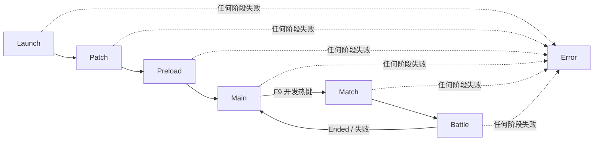
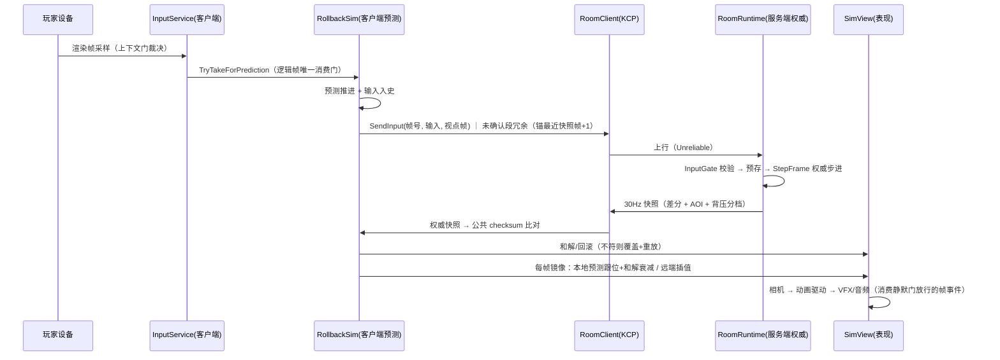
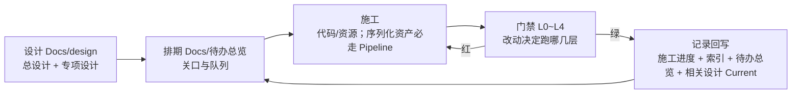

# 02 · 总体流程

> 三张流程图：**① 启动与运行流程**（Unity 启动到可玩）② **对局数据流**（输入到表现的一条完整链）③ **开发与交付流程**（设计到证据回写）。
> 本文描述**当前代码的真实行为**（2026-10-01 核对）；"目标形态"以 `Docs/design/` 为准，缺口以 [待办总览](../待办总览.md) 为准。

## ① 启动与运行流程

### 1.1 引导链（Unity 侧）

```mermaid
flowchart TD
    S[运行 Assets/Scenes/Test.unity] --> GE[GameEntry.Awake<br/>DefaultExecutionOrder -1000 / DontDestroyOnLoad / 重复引导守卫]
    GE --> HOST[new ClientHost + AppLifetime.Bind<br/>接管 Pause/Focus/LowMemory/Quit 与优雅关闭]
    HOST --> MOD[RegisterModules：11 个模块<br/>注册序 = 初始化序 = 关闭逆序]
    MOD --> INIT[host.InitializeAsync → Product&lt;ServiceContainer&gt; / Product&lt;StageMachine&gt;]
    INIT --> START[GameEntry.Start → fsm.Start(ProcedureId.Launch)]
    START --> TICK[GameEntry.Update → 遍历 Tickables.Tick(Time.unscaledDeltaTime)]
    INIT -.失败.-> ERR[ProcedureError.ShowBootstrapError<br/>内建错误态]
```

要点（均有代码依据，见 [GameEntry.cs](../../Assets/LiteGame/App/GameEntry.cs)）：

- 引导件 `GameEntry` 是**唯一的 Unity 引导适配器**：真正的启动与关闭由 `ClientHost` 持有；`GameEntry` 只留一个 `s_booted` 幂等标记（静态纪律）。
- **模块装配序就是依赖图**（Host 不推断）：模块间只能引用更早模块经 `ClientContext.Put/Require` 提供的产物。
- 帧驱动统一在 `GameEntry.Update` 里喂 `Time.unscaledDeltaTime`——**缩放由 `IGameClock` 内部做，不要再用 `Time.deltaTime` 二次乘**；`Seal()` 后容器自动发现 `ITickable`/`IModuleStats`（对局期不再注册 Tickable，改由阶段生命周期驱动）。

### 1.2 模块装配序（11 件）

| # | 模块 | 提供什么 |
|---|---|---|
| ① | `PlatformInfrastructureModule` | 本地持久化 + 日志（先于一切 IO） |
| ② | `ContentModule` | `IContentService`（配置/Lua 字节与资产租约的来源） |
| ③ | `SettingsModule` | 玩家偏好（先于容器：UI/声音壳注册时就要读） |
| ④ | `ClocksModule` | 双轨时钟（World/UI）+ 事件中心 |
| ⑤ | `SchedulersModule` | 时序执行（依赖 ④） |
| ⑥ | `LuaHostModule` | 脚本宿主（同 GameObject 组件） |
| ⑦ | `ConfigModule` | 表投影数据源（依赖 ② 的租约通道） |
| ⑧ | `UiShellModule` | UI 壳（依赖 ②⑥⑦） |
| ⑨ | `PresentationModule` | 表现壳 + 相机服务（依赖 ②④） |
| ⑩ | `InputModule` | 输入服务（设备源；瞄准相机取自 ⑨ 登记的主相机） |
| ⑪ | `ContainerModule` | 容器与流程机（消费以上全部，装配根最后一段） |

各模块一件一文件，住 `Assets/LiteGame/App/Bootstrap/`。

### 1.3 流程机（Procedure）



| 阶段 | 真实行为 | 文件 |
|---|---|---|
| **Launch** | 移交已装配容器：**装配与 `Seal()` 在装配根**（`Bootstrap/ContainerModule`）——流程不参与注册；随后移交 Patch | `Procedure/ProcedureLaunch.cs` |
| **Patch** | 内容事务 `PatchRunner` + 资源包（YooAsset）初始化 | `ProcedurePatch.cs` |
| **Preload** | 配置表加载 + Lua 全量预载 + UI 注册表填充 | `ProcedurePreload.cs` |
| **Main** | 加载**训练场**玩法场景（`ISceneService.LoadAdditiveAsync`，幂等）；打开主页面（`UIMain`）的调用**当前被注释掉**；`F9` → Match | `ProcedureMain.cs` |
| **Match** | 建 Account Scope + `BattleClient` 连接与 Join（含 **buildHash 握手**） | `ProcedureMatch.cs` |
| **Battle** | 对局（见 §②），离场或会话失败后回 Main | `ProcedureBattle.cs` |
| **Error** | 内建最小错误 UI 的确定错误态（终态） | `ProcedureError.cs` |

> **现状提醒（不要误读文档）**：项目当前**没有正式的主菜单/登录/结算入口**——进对局靠开发热键 `F9`、离场 `F10`，两者都在
> `UNITY_EDITOR || DEVELOPMENT_BUILD || LITEFRAMEWORK_DEBUG` 门禁内，正式包不含该入口。正式入口归 U2/G3。

### 1.4 关闭链

`AppLifetime.OnDestroy` → 刷新钩子 → **逆序模块关闭** → 根 Scope 释放（无遗留）；编辑器关闭 Domain Reload 时，静态状态由 `GameEntry.ResetForEditorReload` 等复位点清理（避免二次 Play 引导死锁）。

## ② 对局数据流（输入 → 权威 → 表现）



逐步落点：

| # | 步骤 | 谁做 | 关键契约 |
|---|---|---|---|
| 1 | 渲染帧采样 | `ProcedureBattle.OnUpdate` → `IInputService.SampleOnRenderFrame(本地预测位置)` | 上下文门：登记拦截源任一成立 → 本帧不产生新输入（**瞄准参照取 Sim 预测态，不读平滑后的视图 Transform**） |
| 2 | 逻辑帧推进 | `BattleContext.Tick`（`Frame = State.Frame + 1`） | 同一份输入**既预测又上行**（`OnRealInput` 入史 + `SendInput`） |
| 3 | 上行冗余 | `RoomClient.SendInput` | 未确认段（最近快照帧+1 起，容量 16 帧）重复发送，抗丢包；锚快照 = 预测领先不会甩掉服务器所需帧 |
| 4 | 输入闸门 | `InputGate.Store`（服务端） | 帧号/白名单/去重/数值边界校验 → 按帧预存 |
| 5 | 权威步进 | `RoomRuntime.StepFrame` | 消费预存输入 → `SimStep.Step`（固定顺序）→ 快照环 `Capture` → 记历史 → 回溯判定 |
| 6 | 快照下发 | `SnapshotPipeline.BroadcastIfDue` | 30Hz 抽帧、差分、AOI 过滤、背压分档；快照走 Unreliable、`StartGame` 等信令走 Reliable |
| 7 | 和解 / 回滚 | `RollbackSim`（客户端） | 权威快照用**公共 checksum** 比对 → 不符则权威覆盖 + 重放本地历史；本机输入比对不符则 `ExecuteRollback`；`MaxRollbacksPerFrame` 限幅，越界停预测 |
| 8 | 表现 | `SimView` → `EntityViewMap` → 相机/动画/VFX/音频 | 本地视图跟预测位置并做**和解衰减**，远端插值；和解/回滚期间**帧事件静默门**关闭（不派发视觉事件） |

## ③ 开发与交付流程



**三条全局红线**（详见 [开发导航](../开发导航/README.md)）：

1. **BuildHash 源集**：改 `Assets/LiteSim/Core/{Scripts,Systems}`、`Assets/LiteNet/{Proto,Protocol}` 或两端表数据 → **必须重跑 `python scripts/codegen/gen-build-hash.py`**，否则客户端/服务器 buildHash 不一致，Join 被拒进房（设计内红线，不是 bug）。校验：**构建前** `gen-build-hash.py --check` 复算比对（`build-player.ps1` 门禁步）；开发期不校验。
2. **R11 纯化纪律**：`Assets/RoomServer/Runtime/` 下**禁** Console / 系统时钟 / 文件 IO / proto / LiteNet 引用——违反被 L1 纪律扫描打红。
3. **Unity 序列化资产**：场景 / Prefab / Material / AnimatorController / `.meta` / 工程设置**一律走 unity-pipeline CLI**；直接改文件违规（纯文本 `.cs/.json/.md` 可直接编辑）。

**批次完成定义**（回写清单，惯例见 [施工进度 README](../施工进度/README.md)）：本批 `施工进度/<批>.md`（代码位置 + 命令 + 结果 + 产物 + 剩余边界）→ `施工进度/README.md` 索引行 → `待办总览.md` 状态与证据 → 相关设计的 Current 节；结构性改动再同步 `开发导航/`。**不提前造空完成报告**。

门禁怎么跑（含"什么改动跑什么"速查）见 [05-验证与门禁](05-验证与门禁.md)。